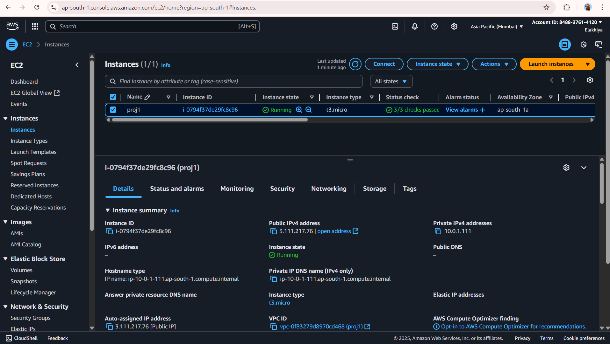
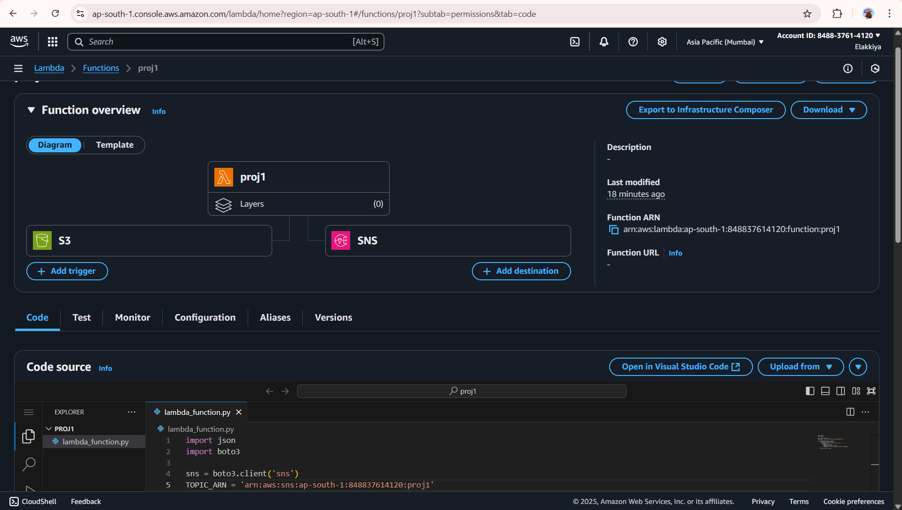
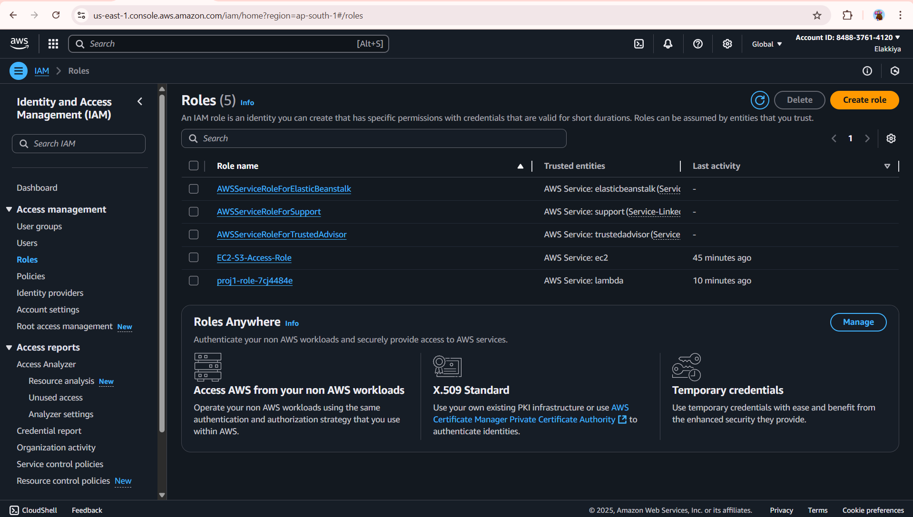
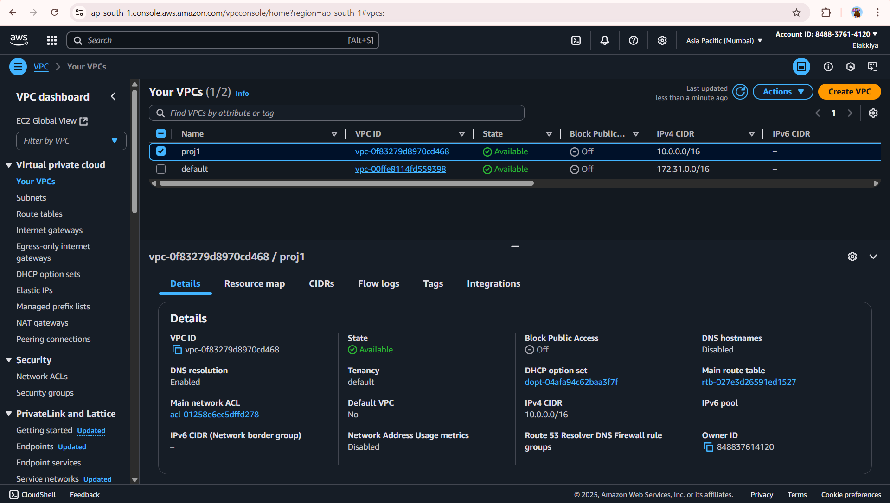
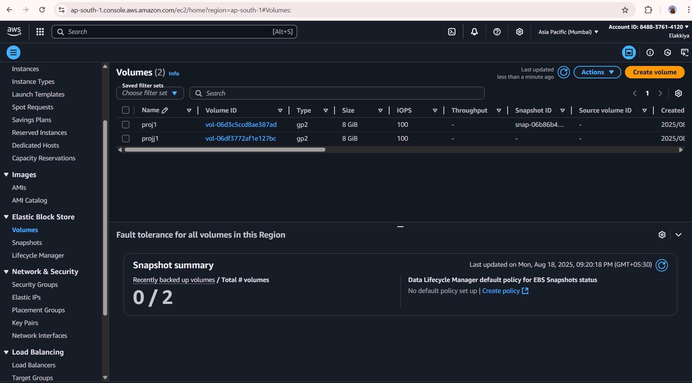

# Static Website Deployment on AWS

## Project Overview
Deployed a static website using AWS S3, EC2, IAM, Lambda, and VPC.

## Tools & Services Used
- AWS S3
- EC2
- IAM
- Lambda
- VPC
- Apache/Nginx

## Project Screenshots

## Project Screenshots

### S3 Bucket

### EC2 Instance

### Lambda Function

### IAM Role

### SNS Trigger

### VPC

### EBS Volume

